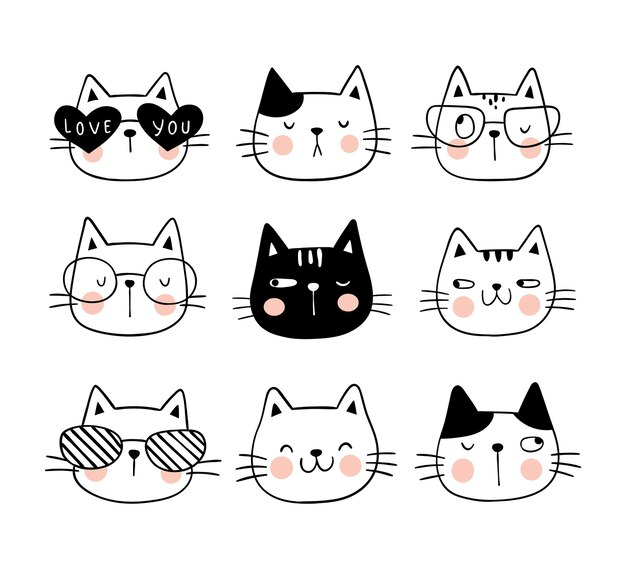
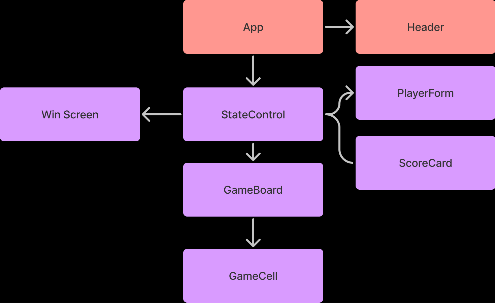

# _Tic-Cat-Toe_

#### By _**Christy Welch, Jacob Wilson**_

#### _Tic tac toe with a cat theme and react-redux._

## Technologies Used

* _React_
* _Redux_
* _JavaScript_
* _CSS_
* _JSX_
* _Jest_
* _Lint_

## Description

_Project for Epicodus, React, Week 3. Used to practice React-Redux. The user is able to play a game of tic-cat-toe and keep a running score with a friend._

## Setup/Installation Requirements

* _You can find the github repository [here](https://github.com/JLEWilson/tic-cat-toe)_
* _Click the code button, and copy the https link_
* _In your in git bash or your preferred git terminal navigate to the directory you would like to store the project_
* _Enter: "git clone" followed by the https link_
* _Now that the repository is cloned to your computer, right click on the folder and click open with vs code_
* _Now type npm install in your terminal to install the packages used in the project, you may have to run install twice due to the size of the packages_
* _You can now view the project by typing npm run start in your terminal_
* _OR_
* _You can find the deployed project on gh-pages [here](https://jlewilson.github.io/tic-cat-toe/)_

## Known Bugs

* _No known bugs_

## License - [MIT](https://opensource.org/licenses/MIT)

_If you run into any problems or find a bug, would like to reach me for a separate reason, feel free to send me an email @jacobleeeugenewilson@gmail.com with details of your issue._

Copyright (c) _02/17/2022_ _Christy Welch, Jacob Wilson_

